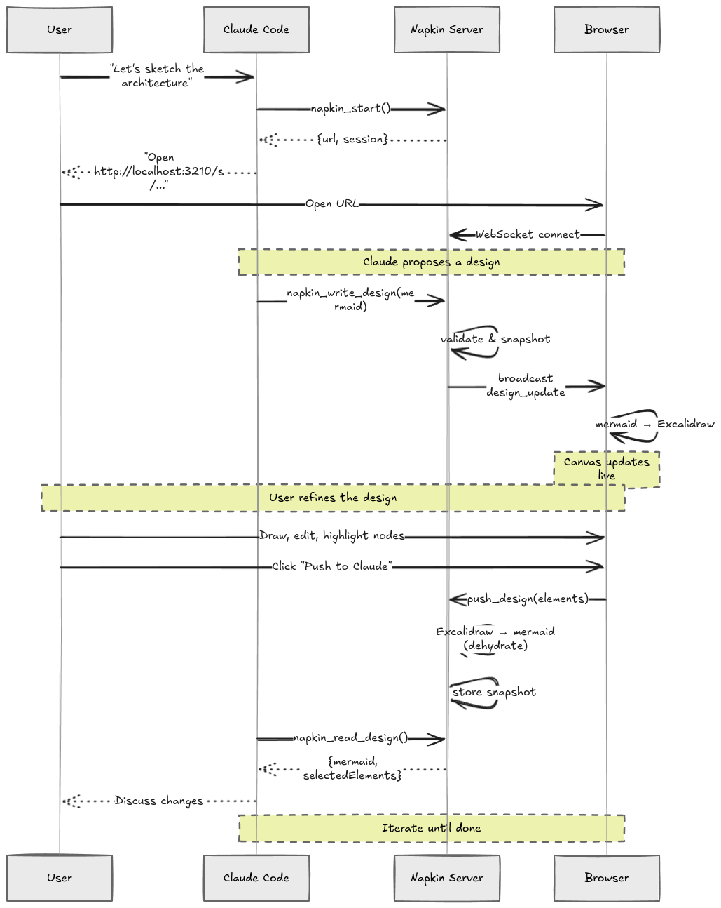
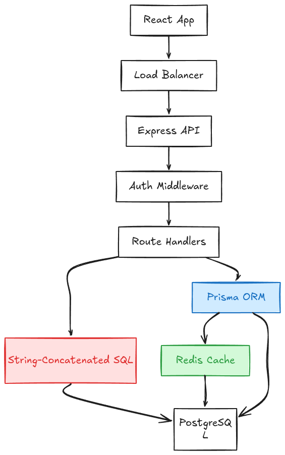

# Napkin

**Collaborative system design on the back of a napkin.**

Napkin is a [Claude Code](https://docs.anthropic.com/en/docs/claude-code) plugin that opens a visual design canvas alongside your terminal. You draw architecture diagrams in [Excalidraw](https://excalidraw.com); Claude reads and writes them as [Mermaid](https://mermaid.js.org/) flowcharts. Push your drawing to Claude, Claude pushes revisions back -- a push-to-talk loop for system design.

```
  You (Excalidraw)                   Claude (Mermaid)

  +---+    +---+                     flowchart TD
  | A |--->| B |   --dehydrate-->      A --> B
  +---+    +---+                       B --> C
              |                        style A fill:...
              v
           +---+   <--hydrate---
           | C |
           +---+

     browser                            MCP tools
```

---

## Quick Start

### Prerequisites

- [Node.js](https://nodejs.org/) v18+
- [Claude Code](https://docs.anthropic.com/en/docs/claude-code) CLI

### Install

```bash
git clone https://github.com/pksebben/Napkin.git
cd Napkin
npm install
npm run build
```

Then install:

```bash
node dist/napkin.cjs install
```

This copies the built artifacts to `~/.local/share/napkin/`, symlinks `~/.local/bin/napkin`, and registers the MCP server with Claude Code. After install, the git clone is no longer needed.

For development, the repo includes a `.mcp.json` that configures the MCP server per-project (requires keeping the clone):

```json
{
  "mcpServers": {
    "napkin": {
      "command": "node",
      "args": ["./dist/napkin.cjs"]
    }
  }
}
```

### Use It

In Claude Code, say something like:

> "Let's sketch out the architecture for this system"

Claude will call `napkin_start`, hand you a URL (default `http://localhost:3210/s/<session>`), and you're off. Draw on the canvas, click **Push to Claude**, and Claude sees your diagram as Mermaid. Claude writes back, and the canvas updates live.

---

## How It Works

1. **You draw** boxes and arrows on the Excalidraw canvas
2. **You push** the design to Claude (button in the UI)
3. **Claude reads** the design as Mermaid via `napkin_read_design`
4. **Claude writes** an updated diagram via `napkin_write_design`
5. **The canvas updates** in real time
6. **Repeat**



### Bidirectional Conversion

| Direction | Process | Library |
|-----------|---------|---------|
| Excalidraw -> Mermaid | **Dehydration** -- shapes become `flowchart TD` syntax | [excalidraw-to-mermaid](https://github.com/pksebben/excalidraw-to-mermaid) |
| Mermaid -> Excalidraw | **Hydration** -- flowchart text becomes positioned shapes | [@excalidraw/mermaid-to-excalidraw](https://www.npmjs.com/package/@excalidraw/mermaid-to-excalidraw) |

Color information round-trips via Mermaid `style` directives.

### Architecture

```
              Shared HTTP Server (Express + WebSocket)
             +----------------------------------------+
             |  Session A    Session B    Session C    |
             |  StateStore   StateStore   StateStore   |
             |     |             |            |        |
             |  WS clients   WS clients   WS clients  |
             +-----|-------------|------------|--------+
                   |             |            |
                Browser A    Browser B    Browser C
               (Excalidraw)  (Excalidraw) (Excalidraw)

             +------------+  +------------+
             | MCP Proc 1 |  | MCP Proc 2 |  <-- separate Claude Code sessions
             | (client)   |  | (client)   |
             +------------+  +------------+
```

Multiple Claude Code sessions share a single HTTP server. The first process starts the server; subsequent processes detect it via a health probe and connect as HTTP clients. If two processes race to start the server, the loser catches `EADDRINUSE` and falls back to client mode. On shutdown, each process only destroys its own sessions; the server stays up until its owner exits.

---

## Features

### Multi-Session Support

Each Claude Code instance can run its own named session -- useful for working on separate designs in parallel:

```
> napkin_start { session: "auth-flow" }       -> http://localhost:3210/s/auth-flow
> napkin_start { session: "data-pipeline" }   -> http://localhost:3210/s/data-pipeline
```

Sessions from different Claude Code instances share the same server and appear in the sidebar.

### Node Highlighting

Claude uses color to communicate status. These survive round-trips as Excalidraw fill/stroke:

| Color | Meaning | Mermaid Directive |
|-------|---------|-------------------|
| Blue | Topic of discussion | `style NODE fill:#d0ebff,stroke:#1971c2` |
| Yellow | New or changed | `style NODE fill:#fff3bf,stroke:#fab005` |
| Red | Problem | `style NODE fill:#ffe0e0,stroke:#e03131` |
| Green | Approved | `style NODE fill:#d3f9d8,stroke:#2f9e44` |

You can also apply colors manually from the highlight buttons in the sidebar.



### History and Rollback

Every design change is recorded as a timestamped snapshot. The History panel lets you browse previous versions, see who made each change (User vs Claude), and restore with one click. Claude can also use `napkin_get_history` and `napkin_rollback` programmatically.

### Persistence

Sessions are persisted to `.napkin/sessions/` as JSON. Restarting the server and creating a session with the same name restores its history from disk.

### Mermaid Validation

Diagrams are validated against the [Mermaid parser](https://github.com/mermaid-js/mermaid) before storage. Supported diagram types:

- `flowchart` / `graph` (TD, LR, BT, RL)
- `sequenceDiagram`
- `classDiagram`

Other types are rejected with a suggestion to use a flowchart.

---

## MCP Tools

| Tool | Description |
|------|-------------|
| `napkin_start` | Start a session. Returns `{ url, session }` |
| `napkin_stop` | Stop one session or all sessions |
| `napkin_read_design` | Read current design as `{ mermaid, selectedElements, nodeCount, edgeCount }` |
| `napkin_write_design` | Write a Mermaid diagram (validated, then pushed to canvas) |
| `napkin_get_history` | Get timestamped design snapshots |
| `napkin_rollback` | Restore a previous design by timestamp |
| `napkin_list_sessions` | List all active sessions |

---

## Development

### Project Structure

```
src/
  client/
    App.tsx              # Main canvas component
    HistoryPanel.tsx     # History browser sidebar
    ws-client.ts         # WebSocket client
  server/
    index.ts             # Entry point (wires MCP + persistence)
    cli.ts               # CLI router (napkin mcp | napkin install)
    mcp.ts               # MCP tool definitions + usage guide prompt
    session-manager.ts   # HTTP client to shared server
    shared-server.ts     # Express + WebSocket server
    state.ts             # In-memory state store per session
    dehydrator.ts        # Excalidraw -> Mermaid conversion
    validator.ts         # Mermaid syntax validation
    persistence.ts       # File-based session persistence
  shared/
    types.ts             # Shared TypeScript interfaces
    colors.ts            # Highlight color definitions
```

### Scripts

```bash
npm run dev:client     # Vite dev server with HMR (port 5173)
npm run dev:server     # TypeScript server with watch mode (port 3210)
npm run build          # Production build (client + server bundle)
npm test               # Run all tests (vitest)
npm run test:watch     # Tests in watch mode
```

For local development, run `dev:client` and `dev:server` in separate terminals. Vite proxies API and WebSocket requests to the backend.

### Running Tests

```bash
npm test
```

83 tests across 7 files covering state, dehydration, validation, persistence, HTTP/WebSocket server, multi-process discovery, MCP tool logic, and MCP prompts.

### Environment Variables

| Variable | Default | Description |
|----------|---------|-------------|
| `NAPKIN_PORT` | `3210` | Port for the shared HTTP server |

---

## Contributing

1. Fork the repo
2. Create a feature branch
3. Write tests first (`npm run test:watch`)
4. Implement the feature
5. Ensure `npm test` and `npm run build` pass
6. Open a PR

---

## License

MIT
