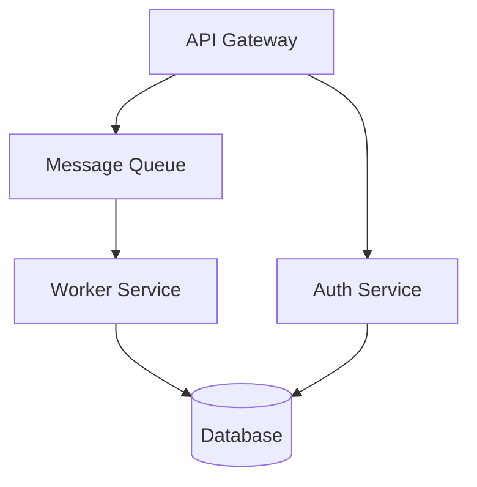

# Napkin Implementation Plan

> **For Claude:** REQUIRED SUB-SKILL: Use superpowers:executing-plans to implement this plan task-by-task.

**Goal:** Build a bidirectional Excalidraw ↔ Mermaid ↔ Claude Code bridge for collaborative system design.

**Architecture:** Single Node.js/TypeScript process. Starts dormant as an MCP stdio server. On `napkin_start`, boots an Express HTTP + WebSocket server that serves a custom Excalidraw React app. User pushes designs from Excalidraw → server dehydrates to Mermaid → Claude reads via MCP. Claude writes Mermaid via MCP → server sends to client → client hydrates to Excalidraw elements.

**Tech Stack:** Node.js, TypeScript, React, Vite, `@excalidraw/excalidraw` 0.18.0, `@excalidraw/mermaid-to-excalidraw` 2.0.0, `excalidraw-to-mermaid` 0.2.1, `@mermaid-js/parser` 1.0.0, `@modelcontextprotocol/sdk` 1.26.x, `ws`, Express.

**Design doc:** `docs/plans/2026-02-21-napkin-design.md`

---

### Task 1: Project Scaffolding

**Files:**
- Create: `package.json`
- Create: `tsconfig.json`
- Create: `tsconfig.node.json`
- Create: `vite.config.ts`
- Create: `index.html`
- Create: `src/client/main.tsx` (placeholder)
- Create: `src/client/App.tsx` (placeholder)
- Create: `src/server/index.ts` (placeholder)
- Create: `src/shared/types.ts` (placeholder)

**Step 1: Initialize npm project**

```bash
npm init -y
```

Edit `package.json`:

```json
{
  "name": "napkin",
  "version": "0.1.0",
  "type": "module",
  "scripts": {
    "dev:client": "vite",
    "dev:server": "tsx watch src/server/index.ts",
    "build:client": "vite build",
    "build:server": "tsc -p tsconfig.node.json",
    "build": "npm run build:client && npm run build:server",
    "test": "vitest run",
    "test:watch": "vitest"
  },
  "bin": {
    "napkin": "./dist/server/cli.js"
  }
}
```

**Step 2: Install dependencies**

```bash
npm install react react-dom @excalidraw/excalidraw @excalidraw/mermaid-to-excalidraw excalidraw-to-mermaid @modelcontextprotocol/sdk @mermaid-js/parser express ws zod
```

```bash
npm install -D typescript @types/react @types/react-dom @types/express @types/ws @vitejs/plugin-react vite vitest tsx
```

**Step 3: Create tsconfig.json (for client/shared code via Vite)**

```json
{
  "compilerOptions": {
    "target": "ES2022",
    "module": "ESNext",
    "moduleResolution": "bundler",
    "jsx": "react-jsx",
    "strict": true,
    "esModuleInterop": true,
    "skipLibCheck": true,
    "outDir": "dist",
    "rootDir": "src",
    "declaration": true
  },
  "include": ["src"]
}
```

**Step 4: Create tsconfig.node.json (for server code compiled with tsc)**

```json
{
  "compilerOptions": {
    "target": "ES2022",
    "module": "Node16",
    "moduleResolution": "Node16",
    "strict": true,
    "esModuleInterop": true,
    "skipLibCheck": true,
    "outDir": "dist/server",
    "rootDir": "src/server",
    "declaration": true
  },
  "include": ["src/server", "src/shared"]
}
```

**Step 5: Create vite.config.ts**

```typescript
import { defineConfig } from "vite";
import react from "@vitejs/plugin-react";

export default defineConfig({
  plugins: [react()],
  root: ".",
  build: {
    outDir: "dist/client",
  },
  optimizeDeps: {
    include: ["@excalidraw/excalidraw"],
    esbuildOptions: {
      target: "es2022",
    },
  },
  server: {
    port: 5173,
  },
});
```

**Step 6: Create index.html**

```html
<!doctype html>
<html lang="en">
  <head>
    <meta charset="UTF-8" />
    <meta name="viewport" content="width=device-width, initial-scale=1.0" />
    <title>Napkin</title>
  </head>
  <body>
    <div id="root"></div>
    <script type="module" src="/src/client/main.tsx"></script>
  </body>
</html>
```

**Step 7: Create placeholder source files**

`src/client/main.tsx`:
```tsx
import React from "react";
import ReactDOM from "react-dom/client";
import App from "./App";

ReactDOM.createRoot(document.getElementById("root")!).render(
  <React.StrictMode>
    <App />
  </React.StrictMode>
);
```

`src/client/App.tsx`:
```tsx
export default function App() {
  return <div>Napkin</div>;
}
```

`src/server/index.ts`:
```typescript
console.error("napkin server placeholder");
```

`src/shared/types.ts`:
```typescript
export type PlaceholderType = {};
```

**Step 8: Verify build works**

```bash
npx vite build
```

Expected: builds successfully to `dist/client/`.

**Step 9: Commit**

```bash
git add -A
git commit -m "feat: project scaffolding with Vite + React + TypeScript"
```

---

### Task 2: Shared Types

**Files:**
- Modify: `src/shared/types.ts`

**Step 1: Define WebSocket message types and state types**

```typescript
// WebSocket messages: client → server
export type ClientMessage =
  | { type: "push_design"; elements: unknown; appState: unknown; selectedElementIds: string[] }

// WebSocket messages: server → client
export type ServerMessage =
  | { type: "design_update"; mermaid: string }
  | { type: "status"; url: string }

// State
export interface DesignSnapshot {
  mermaid: string;
  timestamp: string;
  source: "user" | "claude";
}

export interface NapkinState {
  currentDesign: string | null;           // current mermaid
  selectedElements: string[];             // last selected element IDs from user
  history: DesignSnapshot[];              // timestamped snapshots
}

export interface ReadDesignResult {
  mermaid: string;
  selectedElements: string[];
  nodeCount: number;
  edgeCount: number;
}

export interface WriteDesignResult {
  success: boolean;
  errors?: string[];
}
```

**Step 2: Commit**

```bash
git add src/shared/types.ts
git commit -m "feat: add shared types for WebSocket messages and state"
```

---

### Task 3: State Store

**Files:**
- Create: `src/server/state.ts`
- Create: `src/server/state.test.ts`

**Step 1: Write failing tests**

`src/server/state.test.ts`:
```typescript
import { describe, it, expect, beforeEach } from "vitest";
import { StateStore } from "./state.js";

describe("StateStore", () => {
  let store: StateStore;

  beforeEach(() => {
    store = new StateStore();
  });

  it("starts with no design", () => {
    expect(store.getCurrentDesign()).toBeNull();
  });

  it("stores a user design", () => {
    store.setDesign("flowchart TD\n  A --> B", "user");
    expect(store.getCurrentDesign()).toBe("flowchart TD\n  A --> B");
  });

  it("stores selected elements", () => {
    store.setSelectedElements(["node1", "node2"]);
    expect(store.getSelectedElements()).toEqual(["node1", "node2"]);
  });

  it("snapshots to history on setDesign", () => {
    store.setDesign("flowchart TD\n  A --> B", "user");
    store.setDesign("flowchart TD\n  A --> B --> C", "claude");
    const history = store.getHistory(10);
    expect(history).toHaveLength(2);
    expect(history[0].source).toBe("user");
    expect(history[1].source).toBe("claude");
  });

  it("limits history length", () => {
    for (let i = 0; i < 60; i++) {
      store.setDesign(`flowchart TD\n  A${i} --> B`, "user");
    }
    expect(store.getHistory(100).length).toBeLessThanOrEqual(50);
  });

  it("rolls back to a previous snapshot", () => {
    store.setDesign("flowchart TD\n  A --> B", "user");
    const history = store.getHistory(10);
    const timestamp = history[0].timestamp;
    store.setDesign("flowchart TD\n  X --> Y", "claude");
    store.rollback(timestamp);
    expect(store.getCurrentDesign()).toBe("flowchart TD\n  A --> B");
  });

  it("throws on rollback to nonexistent timestamp", () => {
    expect(() => store.rollback("fake")).toThrow();
  });
});
```

**Step 2: Run tests to verify they fail**

```bash
npx vitest run src/server/state.test.ts
```

Expected: FAIL — `StateStore` not found.

**Step 3: Implement StateStore**

`src/server/state.ts`:
```typescript
import type { DesignSnapshot } from "../shared/types.js";

const MAX_HISTORY = 50;

export class StateStore {
  private currentDesign: string | null = null;
  private selectedElements: string[] = [];
  private history: DesignSnapshot[] = [];

  getCurrentDesign(): string | null {
    return this.currentDesign;
  }

  getSelectedElements(): string[] {
    return this.selectedElements;
  }

  setSelectedElements(ids: string[]): void {
    this.selectedElements = ids;
  }

  setDesign(mermaid: string, source: "user" | "claude"): void {
    this.currentDesign = mermaid;
    this.history.push({
      mermaid,
      timestamp: new Date().toISOString(),
      source,
    });
    if (this.history.length > MAX_HISTORY) {
      this.history = this.history.slice(-MAX_HISTORY);
    }
  }

  getHistory(limit: number): DesignSnapshot[] {
    return this.history.slice(-limit);
  }

  rollback(timestamp: string): void {
    const snapshot = this.history.find((s) => s.timestamp === timestamp);
    if (!snapshot) {
      throw new Error(`No snapshot found for timestamp: ${timestamp}`);
    }
    this.currentDesign = snapshot.mermaid;
  }
}
```

**Step 4: Run tests to verify they pass**

```bash
npx vitest run src/server/state.test.ts
```

Expected: all PASS.

**Step 5: Commit**

```bash
git add src/server/state.ts src/server/state.test.ts
git commit -m "feat: add StateStore with history and rollback"
```

---

### Task 4: Dehydrator (Excalidraw → Mermaid)

**Files:**
- Create: `src/server/dehydrator.ts`
- Create: `src/server/dehydrator.test.ts`

**Step 1: Write failing test**

`src/server/dehydrator.test.ts`:
```typescript
import { describe, it, expect } from "vitest";
import { dehydrate, annotateSelection } from "./dehydrator.js";

describe("dehydrate", () => {
  it("converts excalidraw JSON to mermaid", () => {
    // Minimal excalidraw doc with two rectangles and an arrow
    const doc = {
      type: "excalidraw",
      version: 2,
      elements: [
        {
          id: "rect1",
          type: "rectangle",
          x: 0,
          y: 0,
          width: 200,
          height: 100,
          text: "Service A",
          boundElements: [{ id: "arrow1", type: "arrow" }],
        },
        {
          id: "rect2",
          type: "rectangle",
          x: 300,
          y: 0,
          width: 200,
          height: 100,
          text: "Service B",
          boundElements: [{ id: "arrow1", type: "arrow" }],
        },
        {
          id: "arrow1",
          type: "arrow",
          startBinding: { elementId: "rect1" },
          endBinding: { elementId: "rect2" },
        },
      ],
    };
    const result = dehydrate(doc);
    expect(result.mermaid).toContain("flowchart");
    expect(result.nodeCount).toBeGreaterThanOrEqual(0);
    expect(result.edgeCount).toBeGreaterThanOrEqual(0);
  });
});

describe("annotateSelection", () => {
  it("adds selection comment to mermaid", () => {
    const mermaid = "flowchart TD\n  A --> B";
    const result = annotateSelection(mermaid, ["A", "A-->B"]);
    expect(result).toContain("%% SELECTED: A, A-->B");
    expect(result).toContain("flowchart TD");
  });

  it("returns mermaid unchanged when no selection", () => {
    const mermaid = "flowchart TD\n  A --> B";
    const result = annotateSelection(mermaid, []);
    expect(result).toBe(mermaid);
  });
});
```

**Step 2: Run tests to verify they fail**

```bash
npx vitest run src/server/dehydrator.test.ts
```

Expected: FAIL — module not found.

**Step 3: Implement dehydrator**

`src/server/dehydrator.ts`:
```typescript
import { convert } from "excalidraw-to-mermaid";

export interface DehydrationResult {
  mermaid: string;
  nodeCount: number;
  edgeCount: number;
}

export function dehydrate(
  excalidrawDoc: unknown,
  direction: "TD" | "LR" | "BT" | "RL" = "TD"
): DehydrationResult {
  const result = convert(excalidrawDoc as any, { direction });
  return {
    mermaid: result.mermaid,
    nodeCount: result.nodeCount,
    edgeCount: result.edgeCount,
  };
}

export function annotateSelection(
  mermaid: string,
  selectedElements: string[]
): string {
  if (selectedElements.length === 0) return mermaid;
  return `%% SELECTED: ${selectedElements.join(", ")}\n${mermaid}`;
}
```

**Step 4: Run tests**

```bash
npx vitest run src/server/dehydrator.test.ts
```

Note: the excalidraw doc fixture in the test may need adjustment based on what `excalidraw-to-mermaid` actually expects. Read `node_modules/excalidraw-to-mermaid/src/index.js` to understand the expected input format. Adjust the test fixture to match. The important thing is that `convert()` returns `{ mermaid, nodeCount, edgeCount }`.

**Step 5: Commit**

```bash
git add src/server/dehydrator.ts src/server/dehydrator.test.ts
git commit -m "feat: add dehydrator (Excalidraw JSON → Mermaid)"
```

---

### Task 5: Mermaid Validation

**Files:**
- Create: `src/server/validator.ts`
- Create: `src/server/validator.test.ts`

**Step 1: Write failing tests**

`src/server/validator.test.ts`:
```typescript
import { describe, it, expect } from "vitest";
import { validateMermaid } from "./validator.js";

describe("validateMermaid", () => {
  it("accepts valid flowchart", async () => {
    const result = await validateMermaid("flowchart TD\n  A --> B");
    expect(result.valid).toBe(true);
    expect(result.errors).toBeUndefined();
  });

  it("rejects invalid syntax", async () => {
    const result = await validateMermaid("not a valid diagram {{{");
    expect(result.valid).toBe(false);
    expect(result.errors).toBeDefined();
  });

  it("rejects empty string", async () => {
    const result = await validateMermaid("");
    expect(result.valid).toBe(false);
  });
});
```

**Step 2: Run tests to verify they fail**

```bash
npx vitest run src/server/validator.test.ts
```

**Step 3: Implement validator**

`src/server/validator.ts`:

Note: Read `node_modules/@mermaid-js/parser/` to understand the actual API. The package exports a `parse(diagramType, text)` function. Adapt the implementation to match the actual API:

```typescript
export interface ValidationResult {
  valid: boolean;
  errors?: string[];
}

export async function validateMermaid(input: string): Promise<ValidationResult> {
  if (!input.trim()) {
    return { valid: false, errors: ["Empty mermaid input"] };
  }
  try {
    // Use @mermaid-js/parser to validate
    // Adjust import/call based on actual package API
    const { parse } = await import("@mermaid-js/parser");
    parse("flowchart", input);
    return { valid: true };
  } catch (err: any) {
    return { valid: false, errors: [err.message ?? "Parse error"] };
  }
}
```

If `@mermaid-js/parser`'s API doesn't match this pattern, adapt accordingly. The key contract: return `{ valid: true }` for valid mermaid, `{ valid: false, errors: [...] }` for invalid.

**Step 4: Run tests**

```bash
npx vitest run src/server/validator.test.ts
```

Adjust implementation based on actual parser API until tests pass.

**Step 5: Commit**

```bash
git add src/server/validator.ts src/server/validator.test.ts
git commit -m "feat: add mermaid syntax validator"
```

---

### Task 6: MCP Server with All Tools

**Files:**
- Create: `src/server/mcp.ts`
- Create: `src/server/mcp.test.ts`
- Modify: `src/server/index.ts`

This task wires up the MCP server with all tool definitions. The HTTP/WebSocket server is started lazily by `napkin_start`.

**Step 1: Write failing tests for MCP tool handlers**

`src/server/mcp.test.ts`:
```typescript
import { describe, it, expect, beforeEach } from "vitest";
import { StateStore } from "./state.js";
import {
  handleReadDesign,
  handleWriteDesign,
  handleGetHistory,
  handleRollback,
} from "./mcp.js";

describe("MCP tool handlers", () => {
  let store: StateStore;

  beforeEach(() => {
    store = new StateStore();
  });

  describe("handleReadDesign", () => {
    it("returns null mermaid when no design exists", async () => {
      const result = await handleReadDesign(store);
      expect(result.mermaid).toBeNull();
    });

    it("returns current design with metadata", async () => {
      store.setDesign("flowchart TD\n  A --> B", "user");
      store.setSelectedElements(["A"]);
      const result = await handleReadDesign(store);
      expect(result.mermaid).toBe("flowchart TD\n  A --> B");
      expect(result.selectedElements).toEqual(["A"]);
    });
  });

  describe("handleWriteDesign", () => {
    it("rejects invalid mermaid", async () => {
      const result = await handleWriteDesign(store, "{{{ invalid", () => {});
      expect(result.success).toBe(false);
      expect(result.errors).toBeDefined();
    });

    it("stores valid mermaid and calls broadcast", async () => {
      let broadcasted = false;
      const result = await handleWriteDesign(
        store,
        "flowchart TD\n  A --> B",
        () => { broadcasted = true; }
      );
      expect(result.success).toBe(true);
      expect(store.getCurrentDesign()).toBe("flowchart TD\n  A --> B");
      expect(broadcasted).toBe(true);
    });
  });

  describe("handleGetHistory", () => {
    it("returns empty history initially", () => {
      const result = handleGetHistory(store, 10);
      expect(result).toEqual([]);
    });

    it("returns history entries", () => {
      store.setDesign("flowchart TD\n  A --> B", "user");
      store.setDesign("flowchart TD\n  A --> B --> C", "claude");
      const result = handleGetHistory(store, 10);
      expect(result).toHaveLength(2);
    });
  });

  describe("handleRollback", () => {
    it("restores a previous design", () => {
      store.setDesign("flowchart TD\n  A --> B", "user");
      const ts = store.getHistory(1)[0].timestamp;
      store.setDesign("flowchart TD\n  X --> Y", "claude");
      handleRollback(store, ts);
      expect(store.getCurrentDesign()).toBe("flowchart TD\n  A --> B");
    });
  });
});
```

**Step 2: Run tests to verify they fail**

```bash
npx vitest run src/server/mcp.test.ts
```

**Step 3: Implement MCP tool handlers (pure functions)**

`src/server/mcp.ts`:
```typescript
import { McpServer } from "@modelcontextprotocol/sdk/server/mcp.js";
import { StdioServerTransport } from "@modelcontextprotocol/sdk/server/stdio.js";
import { z } from "zod";
import { StateStore } from "./state.js";
import { validateMermaid } from "./validator.js";
import type { ReadDesignResult, WriteDesignResult, DesignSnapshot } from "../shared/types.js";

// --- Pure handler functions (testable) ---

export async function handleReadDesign(store: StateStore): Promise<ReadDesignResult> {
  return {
    mermaid: store.getCurrentDesign(),
    selectedElements: store.getSelectedElements(),
    nodeCount: 0, // TODO: parse from mermaid
    edgeCount: 0,
  };
}

export async function handleWriteDesign(
  store: StateStore,
  mermaid: string,
  broadcast: (mermaid: string) => void
): Promise<WriteDesignResult> {
  const validation = await validateMermaid(mermaid);
  if (!validation.valid) {
    return { success: false, errors: validation.errors };
  }
  store.setDesign(mermaid, "claude");
  broadcast(mermaid);
  return { success: true };
}

export function handleGetHistory(store: StateStore, limit: number): DesignSnapshot[] {
  return store.getHistory(limit);
}

export function handleRollback(store: StateStore, timestamp: string): void {
  store.rollback(timestamp);
}

// --- MCP server wiring ---

export function createMcpServer(
  store: StateStore,
  startHttpServer: () => Promise<string>,
  stopHttpServer: () => Promise<void>,
  broadcastDesign: (mermaid: string) => void
): McpServer {
  const server = new McpServer({ name: "napkin", version: "0.1.0" });

  server.tool(
    "napkin_start",
    "Start the Napkin Excalidraw server. Returns the URL to open in a browser.",
    async () => {
      const url = await startHttpServer();
      return { content: [{ type: "text", text: JSON.stringify({ url }) }] };
    }
  );

  server.tool(
    "napkin_stop",
    "Stop the Napkin Excalidraw server.",
    async () => {
      await stopHttpServer();
      return { content: [{ type: "text", text: JSON.stringify({ stopped: true }) }] };
    }
  );

  server.tool(
    "napkin_read_design",
    "Read the current system design as a Mermaid flowchart. Returns the mermaid string and any elements the user highlighted.",
    async () => {
      const result = await handleReadDesign(store);
      return { content: [{ type: "text", text: JSON.stringify(result) }] };
    }
  );

  server.tool(
    "napkin_write_design",
    "Write an updated system design as a Mermaid flowchart. Validates syntax and pushes to the user's Excalidraw canvas live.",
    { mermaid: z.string().describe("The mermaid flowchart syntax") },
    async ({ mermaid }) => {
      const result = await handleWriteDesign(store, mermaid, broadcastDesign);
      return {
        content: [{ type: "text", text: JSON.stringify(result) }],
        isError: !result.success,
      };
    }
  );

  server.tool(
    "napkin_get_history",
    "Get timestamped history of design snapshots.",
    { limit: z.number().optional().default(10).describe("Max number of snapshots to return") },
    async ({ limit }) => {
      const result = handleGetHistory(store, limit);
      return { content: [{ type: "text", text: JSON.stringify(result) }] };
    }
  );

  server.tool(
    "napkin_rollback",
    "Rollback the design to a previous snapshot by timestamp.",
    { timestamp: z.string().describe("ISO timestamp of the snapshot to restore") },
    async ({ timestamp }) => {
      try {
        handleRollback(store, timestamp);
        return { content: [{ type: "text", text: JSON.stringify({ success: true }) }] };
      } catch (err: any) {
        return {
          content: [{ type: "text", text: JSON.stringify({ success: false, error: err.message }) }],
          isError: true,
        };
      }
    }
  );

  return server;
}

export async function startMcpServer(server: McpServer): Promise<void> {
  const transport = new StdioServerTransport();
  await server.connect(transport);
}
```

**Step 4: Run tests**

```bash
npx vitest run src/server/mcp.test.ts
```

Expected: all PASS.

**Step 5: Commit**

```bash
git add src/server/mcp.ts src/server/mcp.test.ts
git commit -m "feat: add MCP server with all tool handlers"
```

---

### Task 7: HTTP + WebSocket Server

**Files:**
- Create: `src/server/http-server.ts`
- Modify: `src/server/index.ts`

This task creates the lazy-started HTTP + WebSocket server and wires everything together in the main entry point.

**Step 1: Implement the HTTP + WebSocket server**

`src/server/http-server.ts`:
```typescript
import express from "express";
import { createServer, type Server } from "http";
import { WebSocketServer, WebSocket } from "ws";
import path from "path";
import { fileURLToPath } from "url";
import type { ClientMessage, ServerMessage } from "../shared/types.js";

const __dirname = path.dirname(fileURLToPath(import.meta.url));

export interface HttpServerOptions {
  port?: number;
  onPushDesign: (elements: unknown, appState: unknown, selectedElementIds: string[]) => void;
}

export interface HttpServerInstance {
  url: string;
  broadcast: (msg: ServerMessage) => void;
  close: () => Promise<void>;
}

export async function startHttpServer(options: HttpServerOptions): Promise<HttpServerInstance> {
  const port = options.port ?? 3210;
  const app = express();

  // Serve the built Vite client from dist/client
  const clientDir = path.resolve(__dirname, "../client");
  app.use(express.static(clientDir));
  // SPA fallback
  app.get("*", (_req, res) => {
    res.sendFile(path.join(clientDir, "index.html"));
  });

  const httpServer = createServer(app);
  const wss = new WebSocketServer({ server: httpServer });

  const clients = new Set<WebSocket>();

  wss.on("connection", (ws) => {
    clients.add(ws);
    ws.on("close", () => clients.delete(ws));
    ws.on("message", (data) => {
      try {
        const msg: ClientMessage = JSON.parse(data.toString());
        if (msg.type === "push_design") {
          options.onPushDesign(msg.elements, msg.appState, msg.selectedElementIds);
        }
      } catch (err) {
        console.error("Invalid WS message:", err);
      }
    });
  });

  function broadcast(msg: ServerMessage): void {
    const payload = JSON.stringify(msg);
    for (const client of clients) {
      if (client.readyState === WebSocket.OPEN) {
        client.send(payload);
      }
    }
  }

  await new Promise<void>((resolve) => {
    httpServer.listen(port, () => resolve());
  });

  const url = `http://localhost:${port}`;
  console.error(`Napkin server listening at ${url}`);

  return {
    url,
    broadcast,
    close: () => new Promise<void>((resolve) => {
      wss.close();
      httpServer.close(() => resolve());
    }),
  };
}
```

**Step 2: Wire everything together in the entry point**

`src/server/index.ts`:
```typescript
import { StateStore } from "./state.js";
import { createMcpServer, startMcpServer } from "./mcp.js";
import { startHttpServer, type HttpServerInstance } from "./http-server.js";
import { dehydrate } from "./dehydrator.js";

const store = new StateStore();
let httpInstance: HttpServerInstance | null = null;

function broadcastDesign(mermaid: string): void {
  httpInstance?.broadcast({ type: "design_update", mermaid });
}

function onPushDesign(elements: unknown, appState: unknown, selectedElementIds: string[]): void {
  try {
    const doc = { type: "excalidraw", version: 2, elements, appState };
    const result = dehydrate(doc);
    store.setDesign(result.mermaid, "user");
    store.setSelectedElements(selectedElementIds);
    console.error(`Design pushed: ${result.nodeCount} nodes, ${result.edgeCount} edges`);
  } catch (err) {
    console.error("Dehydration failed:", err);
  }
}

const mcpServer = createMcpServer(
  store,
  async () => {
    if (httpInstance) return httpInstance.url;
    httpInstance = await startHttpServer({ onPushDesign });
    return httpInstance.url;
  },
  async () => {
    if (httpInstance) {
      await httpInstance.close();
      httpInstance = null;
    }
  },
  broadcastDesign
);

startMcpServer(mcpServer).catch((err) => {
  console.error("MCP server failed:", err);
  process.exit(1);
});
```

**Step 3: Verify the server starts in dormant mode**

```bash
echo '{"jsonrpc":"2.0","id":1,"method":"initialize","params":{"protocolVersion":"2024-11-05","capabilities":{},"clientInfo":{"name":"test","version":"0.1.0"}}}' | npx tsx src/server/index.ts
```

Expected: MCP initialization response on stdout, server stays alive.

**Step 4: Commit**

```bash
git add src/server/http-server.ts src/server/index.ts
git commit -m "feat: add HTTP/WebSocket server with lazy start + wire MCP entry point"
```

---

### Task 8: Excalidraw Frontend — Basic Canvas

**Files:**
- Modify: `src/client/App.tsx`
- Modify: `src/client/main.tsx`

**Step 1: Implement the basic Excalidraw canvas**

`src/client/main.tsx`:
```tsx
import React from "react";
import ReactDOM from "react-dom/client";
import "@excalidraw/excalidraw/index.css";
import App from "./App";

ReactDOM.createRoot(document.getElementById("root")!).render(
  <React.StrictMode>
    <App />
  </React.StrictMode>
);
```

`src/client/App.tsx`:
```tsx
import { useState } from "react";
import { Excalidraw, CaptureUpdateAction } from "@excalidraw/excalidraw";
import type { ExcalidrawImperativeAPI } from "@excalidraw/excalidraw";

export default function App() {
  const [api, setApi] = useState<ExcalidrawImperativeAPI | null>(null);

  return (
    <div style={{ width: "100vw", height: "100vh" }}>
      <Excalidraw
        excalidrawAPI={(a) => setApi(a)}
        initialData={{
          elements: [],
          appState: { viewBackgroundColor: "#ffffff" },
        }}
      />
    </div>
  );
}
```

**Step 2: Verify it renders**

```bash
npx vite --open
```

Expected: browser opens with a blank Excalidraw canvas. You can draw shapes.

**Step 3: Commit**

```bash
git add src/client/App.tsx src/client/main.tsx
git commit -m "feat: add basic Excalidraw canvas"
```

---

### Task 9: WebSocket Client + Hydration

**Files:**
- Create: `src/client/ws-client.ts`
- Modify: `src/client/App.tsx`

**Step 1: Create WebSocket client**

`src/client/ws-client.ts`:
```typescript
import type { ClientMessage, ServerMessage } from "../shared/types";

export type MessageHandler = (msg: ServerMessage) => void;

export class NapkinSocket {
  private ws: WebSocket | null = null;
  private handlers: Set<MessageHandler> = new Set();

  connect(url: string): void {
    this.ws = new WebSocket(url);
    this.ws.onmessage = (event) => {
      try {
        const msg: ServerMessage = JSON.parse(event.data);
        for (const handler of this.handlers) {
          handler(msg);
        }
      } catch (err) {
        console.error("Invalid WS message:", err);
      }
    };
    this.ws.onclose = () => {
      console.log("WebSocket closed, reconnecting in 2s...");
      setTimeout(() => this.connect(url), 2000);
    };
  }

  onMessage(handler: MessageHandler): () => void {
    this.handlers.add(handler);
    return () => this.handlers.delete(handler);
  }

  send(msg: ClientMessage): void {
    if (this.ws?.readyState === WebSocket.OPEN) {
      this.ws.send(JSON.stringify(msg));
    }
  }
}
```

**Step 2: Wire hydration into App.tsx**

Update `src/client/App.tsx` to:
- Connect to WebSocket on mount
- Listen for `design_update` messages
- Hydrate mermaid → Excalidraw elements using `@excalidraw/mermaid-to-excalidraw`
- Manage two scene states: "My Draft" and "Claude's Revision"
- Add tab switching UI

```tsx
import { useState, useEffect, useRef, useCallback } from "react";
import {
  Excalidraw,
  CaptureUpdateAction,
  convertToExcalidrawElements,
} from "@excalidraw/excalidraw";
import { parseMermaidToExcalidraw } from "@excalidraw/mermaid-to-excalidraw";
import type { ExcalidrawImperativeAPI, ExcalidrawElement } from "@excalidraw/excalidraw";
import { NapkinSocket } from "./ws-client";

type Tab = "draft" | "claude";

export default function App() {
  const [api, setApi] = useState<ExcalidrawImperativeAPI | null>(null);
  const [activeTab, setActiveTab] = useState<Tab>("draft");
  const socketRef = useRef<NapkinSocket | null>(null);

  // Store scenes separately
  const draftElementsRef = useRef<readonly ExcalidrawElement[]>([]);
  const claudeElementsRef = useRef<readonly ExcalidrawElement[]>([]);

  // Connect WebSocket
  useEffect(() => {
    const socket = new NapkinSocket();
    socketRef.current = socket;
    // Connect to same host the page was served from
    const wsUrl = `ws://${window.location.host}`;
    socket.connect(wsUrl);

    socket.onMessage(async (msg) => {
      if (msg.type === "design_update") {
        try {
          const { elements: skeleton } = await parseMermaidToExcalidraw(msg.mermaid);
          const elements = convertToExcalidrawElements(skeleton);
          claudeElementsRef.current = elements;
          // If on Claude tab, update the canvas live
          if (activeTab === "claude" && api) {
            api.updateScene({
              elements,
              captureUpdate: CaptureUpdateAction.NEVER,
            });
          }
        } catch (err) {
          console.error("Hydration failed:", err);
        }
      }
    });

    return () => { socketRef.current = null; };
  }, []);

  // Handle tab switch
  const switchTab = useCallback(
    (tab: Tab) => {
      if (!api || tab === activeTab) return;
      // Save current tab's elements
      const current = api.getSceneElements();
      if (activeTab === "draft") {
        draftElementsRef.current = current;
      }
      // Load target tab's elements
      const targetElements =
        tab === "draft" ? draftElementsRef.current : claudeElementsRef.current;
      api.updateScene({
        elements: targetElements as any,
        captureUpdate: CaptureUpdateAction.NEVER,
      });
      setActiveTab(tab);
    },
    [api, activeTab]
  );

  // Push to Claude
  const pushToClaude = useCallback(() => {
    if (!api || !socketRef.current) return;
    const elements = api.getSceneElements();
    const appState = api.getAppState();
    const selectedIds = Object.keys(appState.selectedElementIds || {});
    socketRef.current.send({
      type: "push_design",
      elements: elements as any,
      appState: appState as any,
      selectedElementIds: selectedIds,
    });
  }, [api]);

  const tabStyle = (tab: Tab) => ({
    padding: "8px 16px",
    cursor: "pointer",
    borderBottom: activeTab === tab ? "2px solid #1971c2" : "2px solid transparent",
    background: "none",
    border: "none",
    borderBottomStyle: "solid" as const,
    borderBottomWidth: "2px",
    borderBottomColor: activeTab === tab ? "#1971c2" : "transparent",
    fontWeight: activeTab === tab ? "bold" as const : "normal" as const,
    fontSize: "14px",
  });

  return (
    <div style={{ width: "100vw", height: "100vh", display: "flex", flexDirection: "column" }}>
      {/* Toolbar */}
      <div
        style={{
          display: "flex",
          alignItems: "center",
          gap: "8px",
          padding: "4px 12px",
          borderBottom: "1px solid #e0e0e0",
          background: "#fafafa",
          zIndex: 10,
        }}
      >
        <button style={tabStyle("draft")} onClick={() => switchTab("draft")}>
          My Draft
        </button>
        <button style={tabStyle("claude")} onClick={() => switchTab("claude")}>
          Claude's Revision
        </button>
        <div style={{ flex: 1 }} />
        <button
          onClick={pushToClaude}
          style={{
            padding: "6px 16px",
            background: "#1971c2",
            color: "white",
            border: "none",
            borderRadius: "4px",
            cursor: "pointer",
            fontSize: "13px",
          }}
        >
          Push to Claude
        </button>
      </div>
      {/* Canvas */}
      <div style={{ flex: 1 }}>
        <Excalidraw
          excalidrawAPI={(a) => setApi(a)}
          initialData={{
            elements: [],
            appState: { viewBackgroundColor: "#ffffff" },
          }}
        />
      </div>
    </div>
  );
}
```

**Step 3: Verify manually**

Start the server and client:
```bash
npx vite --open
```

Expected: Excalidraw canvas with "My Draft" / "Claude's Revision" tabs and a "Push to Claude" button.

**Step 4: Commit**

```bash
git add src/client/ws-client.ts src/client/App.tsx
git commit -m "feat: add WebSocket client, hydration, tabs, and push button"
```

---

### Task 10: CLI Entry Point + Install Command

**Files:**
- Create: `src/server/cli.ts`

**Step 1: Implement the CLI**

`src/server/cli.ts`:
```typescript
#!/usr/bin/env node

import fs from "fs";
import path from "path";
import os from "os";

const command = process.argv[2];

if (command === "mcp") {
  // Start the MCP server (dormant mode)
  // Dynamic import so the MCP server only loads when needed
  await import("./index.js");
} else if (command === "install") {
  // Add napkin to .claude/mcp.json
  const claudeDir = path.join(os.homedir(), ".claude");
  const mcpJsonPath = path.join(claudeDir, "mcp.json");

  if (!fs.existsSync(claudeDir)) {
    fs.mkdirSync(claudeDir, { recursive: true });
  }

  let mcpConfig: any = { mcpServers: {} };
  if (fs.existsSync(mcpJsonPath)) {
    mcpConfig = JSON.parse(fs.readFileSync(mcpJsonPath, "utf-8"));
    mcpConfig.mcpServers = mcpConfig.mcpServers || {};
  }

  mcpConfig.mcpServers.napkin = {
    command: "napkin",
    args: ["mcp"],
  };

  fs.writeFileSync(mcpJsonPath, JSON.stringify(mcpConfig, null, 2) + "\n");
  console.log(`Napkin added to ${mcpJsonPath}`);
  console.log("Restart Claude Code to activate.");
} else {
  console.log("Usage:");
  console.log("  napkin mcp       Start the MCP server (used by Claude Code)");
  console.log("  napkin install   Add Napkin to Claude Code's MCP config");
}
```

**Step 2: Verify CLI help**

```bash
npx tsx src/server/cli.ts
```

Expected: prints usage info.

**Step 3: Commit**

```bash
git add src/server/cli.ts
git commit -m "feat: add CLI with mcp and install commands"
```

---

### Task 11: Claude Skill

**Files:**
- Create: `skill/napkin.md`

**Step 1: Write the skill file**

`skill/napkin.md`:
```markdown
---
name: napkin
description: Use when the user wants to sketch, draw, or discuss system architecture visually. Triggers on phrases like "grab a napkin", "sketch this out", "draw the architecture", "system diagram", "let's design this".
---

# Napkin — Collaborative System Design

You have access to Napkin, a tool that lets you and the user collaborate on system architecture diagrams in real time. The user draws in Excalidraw on one side of their screen while chatting with you on the other.

## How It Works

1. **Start Napkin** — call `napkin_start` to boot the Excalidraw server
2. **Share the URL** — give the user the URL to open in their browser
3. **Read designs** — when the user pushes a design, call `napkin_read_design`
4. **Write designs** — to suggest changes, call `napkin_write_design` with valid Mermaid flowchart syntax
5. **Review history** — use `napkin_get_history` and `napkin_rollback` to navigate versions

## Rules

- Do NOT call `napkin_start` proactively. Only start it when the user asks to sketch or design.
- When writing mermaid, always use `flowchart TD` (or `LR`) syntax. Other diagram types are not supported for round-tripping.
- Reference specific nodes and edges by their mermaid IDs when discussing the design.
- If `napkin_read_design` returns `selectedElements`, the user is pointing at those specific elements — focus your response on them.
- Keep mermaid diagrams clean and readable. Use descriptive node labels.

## Example Mermaid



## Workflow Pattern

1. User: "Let's sketch out the architecture"
2. You: call `napkin_start`, share URL
3. User draws initial design, clicks "Push to Claude"
4. You: call `napkin_read_design`, analyze the design, discuss
5. You suggest improvements: call `napkin_write_design` — user sees updates on "Claude's Revision" tab
6. User refines, pushes again. Iterate.
```

**Step 2: Commit**

```bash
git add skill/napkin.md
git commit -m "feat: add Claude skill for Napkin architecture collaboration"
```

---

### Task 12: Build + Package Configuration

**Files:**
- Modify: `package.json`
- Modify: `tsconfig.node.json`

**Step 1: Update package.json with build scripts and bin**

Ensure `package.json` has:
```json
{
  "bin": {
    "napkin": "./dist/server/cli.js"
  },
  "files": [
    "dist/",
    "skill/"
  ],
  "scripts": {
    "dev:client": "vite",
    "dev:server": "tsx watch src/server/index.ts",
    "build:client": "vite build",
    "build:server": "tsc -p tsconfig.node.json",
    "build": "npm run build:client && npm run build:server",
    "test": "vitest run",
    "test:watch": "vitest",
    "prepublishOnly": "npm run build"
  }
}
```

**Step 2: Verify the full build**

```bash
npm run build
```

Expected: `dist/client/` has the built Vite app, `dist/server/` has compiled server code.

**Step 3: Verify the CLI works from the built output**

```bash
node dist/server/cli.js
```

Expected: prints usage info.

**Step 4: Commit**

```bash
git add package.json tsconfig.node.json
git commit -m "feat: add build configuration and packaging"
```

---

### Task 13: End-to-End Verification

**Files:** none (manual testing)

This is a manual verification of the full loop.

**Step 1: Build everything**

```bash
npm run build
```

**Step 2: Start the MCP server manually**

In one terminal:
```bash
npx tsx src/server/index.ts
```

Then send MCP messages via stdin to verify tools work. Test `napkin_start`:

```json
{"jsonrpc":"2.0","id":1,"method":"initialize","params":{"protocolVersion":"2024-11-05","capabilities":{},"clientInfo":{"name":"test","version":"0.1.0"}}}
```

Then:
```json
{"jsonrpc":"2.0","id":2,"method":"tools/call","params":{"name":"napkin_start","arguments":{}}}
```

Expected: response with `{ "url": "http://localhost:3210" }`.

**Step 3: Open the URL in a browser**

Navigate to `http://localhost:3210`. Expected: Excalidraw canvas with tabs and Push button.

**Step 4: Test the push flow**

1. Draw some shapes with text labels and arrows in Excalidraw
2. Click "Push to Claude"
3. In the MCP terminal, send:
```json
{"jsonrpc":"2.0","id":3,"method":"tools/call","params":{"name":"napkin_read_design","arguments":{}}}
```
4. Expected: response contains a mermaid flowchart derived from your drawing

**Step 5: Test the write flow**

Send via MCP:
```json
{"jsonrpc":"2.0","id":4,"method":"tools/call","params":{"name":"napkin_write_design","arguments":{"mermaid":"flowchart TD\n    A[API Gateway] --> B[Auth Service]\n    A --> C[Message Queue]\n    C --> D[Worker]\n    D --> E[(Database)]"}}}
```

Expected: "Claude's Revision" tab in the browser shows the new diagram.

**Step 6: Commit any fixes**

```bash
git add -A
git commit -m "fix: end-to-end verification fixes"
```

---

## Task Summary

| Task | Description | Type |
|------|-------------|------|
| 1 | Project scaffolding | Setup |
| 2 | Shared types | Types |
| 3 | State store | TDD |
| 4 | Dehydrator (Excalidraw → Mermaid) | TDD |
| 5 | Mermaid validation | TDD |
| 6 | MCP server with all tools | TDD |
| 7 | HTTP + WebSocket server + entry point | Server |
| 8 | Excalidraw frontend — basic canvas | Frontend |
| 9 | WebSocket client + hydration + tabs + push | Frontend |
| 10 | CLI entry point + install command | CLI |
| 11 | Claude skill | Skill |
| 12 | Build + package configuration | Build |
| 13 | End-to-end verification | Testing |
