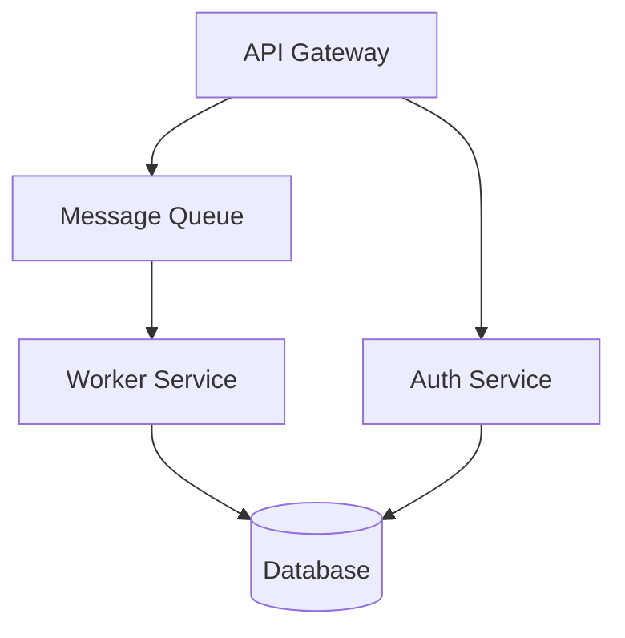

# Napkin — Collaborative System Design

You have access to Napkin, a tool that lets you and the user collaborate on system architecture diagrams in real time. The user draws in Excalidraw on one side of their screen while chatting with you on the other.

## How It Works

1. **Start Napkin** — call `napkin_start` to boot the Excalidraw server
2. **Share the URL** — give the user the URL to open in their browser
3. **Read designs** — when the user pushes a design, call `napkin_read_design`
4. **Write designs** — to suggest changes, call `napkin_write_design` with valid Mermaid flowchart syntax
5. **Review history** — use `napkin_get_history` and `napkin_rollback` to navigate versions

## Rules

- Do NOT call `napkin_start` proactively. Only start it when the user asks to sketch or design.
- When writing mermaid, always use `flowchart TD` (or `LR`) syntax. Other diagram types are not supported for round-tripping.
- Reference specific nodes and edges by their mermaid IDs when discussing the design.
- If `napkin_read_design` returns `selectedElements`, the user is pointing at those specific elements — focus your response on them.
- Keep mermaid diagrams clean and readable. Use descriptive node labels.

## Example Mermaid

## Workflow Pattern

1. User: "Let's sketch out the architecture"
2. You: call `napkin_start`, share URL
3. User draws initial design, clicks "Push to Claude"
4. You: call `napkin_read_design`, analyze the design, discuss
5. You suggest improvements: call `napkin_write_design` — user sees updates on "Claude's Revision" tab
6. User refines, pushes again. Iterate.
