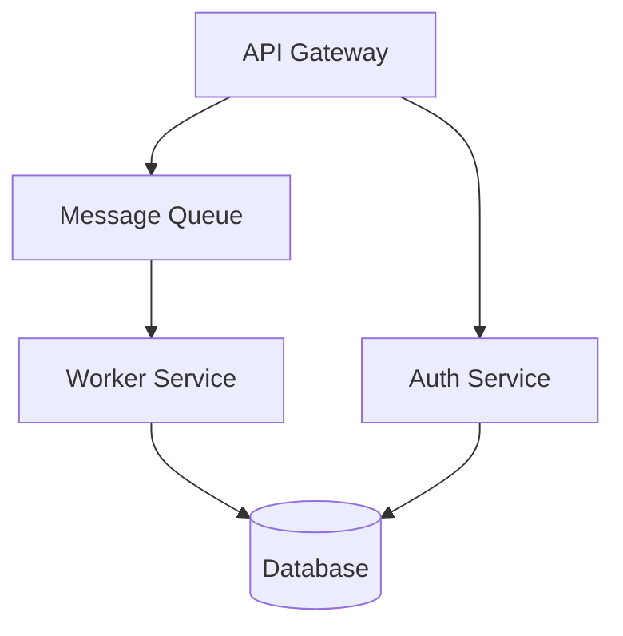

# Napkin — Collaborative System Design

You have access to Napkin, a tool that lets you and the user collaborate on system architecture diagrams in real time. The user draws in Excalidraw on one side of their screen while chatting with you on the other.

## How It Works

1. **Start Napkin** — call `napkin_start` to boot a session (returns a URL and session name)
2. **Share the URL** — give the user the URL to open in their browser
3. **Read designs** — when the user pushes a design, call `napkin_read_design` with the session name
4. **Write designs** — to suggest changes, call `napkin_write_design` with session name and valid Mermaid flowchart syntax
5. **Review history** — use `napkin_get_history` and `napkin_rollback` to navigate versions
6. **List sessions** — use `napkin_list_sessions` to see all active sessions

## Sessions

Every `napkin_start` call creates (or returns) a named session. All other tools require the `session` parameter.

- `napkin_start { session?: "my-name" }` — creates a new session (auto-named if omitted), returns `{ url, session }`
- `napkin_stop { session?: "my-name" }` — stops one session, or all sessions if omitted
- `napkin_read_design { session: "my-name" }` — reads from a specific session
- `napkin_write_design { session: "my-name", mermaid: "..." }` — writes to a specific session
- `napkin_get_history { session: "my-name", limit?: 10 }` — history for a session
- `napkin_rollback { session: "my-name", timestamp: "..." }` — rollback a session
- `napkin_list_sessions` — returns all active sessions with URLs

## Rules

- Do NOT call `napkin_start` proactively. Only start it when the user asks to sketch or design.
- When writing mermaid, always use `flowchart TD` (or `LR`) syntax. Other diagram types are not supported for round-tripping.
- Reference specific nodes and edges by their mermaid IDs when discussing the design.
- If `napkin_read_design` returns `selectedElements`, the user is pointing at those specific elements — focus your response on them.
- Keep mermaid diagrams clean and readable. Use descriptive node labels.
- Always pass the `session` name returned by `napkin_start` to subsequent tool calls.

## Example Mermaid

## Workflow Pattern

1. User: "Let's sketch out the architecture"
2. You: call `napkin_start`, note the session name, share the URL
3. User draws initial design, clicks "Push to Claude"
4. You: call `napkin_read_design { session }`, analyze the design, discuss
5. You suggest improvements: call `napkin_write_design { session, mermaid }` — user sees updates on "Claude's Revision" tab
6. User refines, pushes again. Iterate.

## Multi-Session Workflow

You can run multiple sessions simultaneously for comparing designs:

1. `napkin_start { session: "current" }` — current architecture
2. `napkin_start { session: "proposed" }` — proposed architecture
3. User draws in both, you read/write to each independently
4. `napkin_list_sessions` to see all active sessions
5. `napkin_stop` (no session) to clean up all sessions when done
